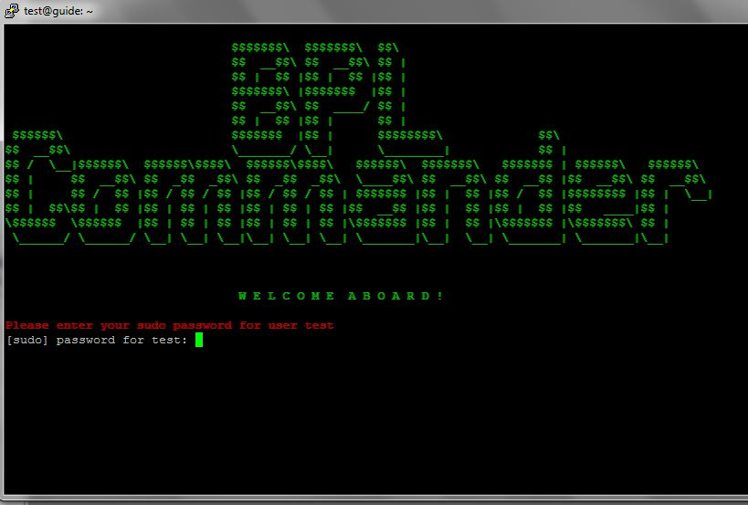

# Blockpool Node Installation

An easy to use bash script for managing a Blockpool Node

## Method 1 via BPL-commander

### DO NOT RUN BPL COMMANDER AS ROOT 

#### Create a user

1. Use the `adduser` command to add a new user to your system. Be sure to replace username with the user that you want to create.

	`adduser username`


2. Set and confirm the new user's password at the prompt. A strong password is highly recommended!


3. Follow the prompts to set the new user's information. It is fine to accept the defaults to leave all of this information blank.


4. Use the usermod command to add the user to the sudo group.

	`usermod -aG sudo username`
	
	Again replacing username with the name used in step #1


5. Switch to the new user

	`su - username`

#### Get BPL-Commander

##### Via Git:

1. Clone the repo

	`git clone https://github.com/blockpool-io/BPL-Commander.git`

2. Move to the folder

	`cd BPL-Commander`

3. Make the script executable

	`chmod +x BPLcommander.sh`

4. Start BPLcommander

	`./BPLcommander.sh`

5. Jump to (Using BPL-Commander)[/BPL-Node.md#using-bpl-commander]

##### Via wget

1. Get the script

	`wget https://raw.githubusercontent.com/blockpool-io/BPL-Commander/master/BPLcommander.sh `

	This will place BPLcommander.sh in the root of your Home folder (or your current dir if not Home)

2. Make the script executable

	`chmod +x BPLcommander.sh`

3. Start BPLcommander

	`./BPLcommander.sh`


#### Using BPL-Commander

- BPL commander will ask for your sudo password. This is needed to update your package sources. If you are hosting on a service that uses a private key, no action will be needed.



- Hit enter when prompted to begin the update process


- When it's finished you will have to reboot for the changes to take affect. In the terminal enter


```
sudo reboot
```

Then relogin (As the user you created, not root)

- Restard the commander with
```
./BPLcommander.sh
```

And you will be greeted with the main menu


- Select option #1 to install BPL node

- After a successful install you will be prompted to input your passphrase


Press Y to apply your config

- If all goes right you will be greated your node successfuly starting


## Method 2 step by step


### Create a user for the node

1. Use the `adduser` command to add a new user to your system. Be sure to replace username with the user that you want to create.

	`adduser username`


2. Set and confirm the new user's password at the prompt. A strong password is highly recommended!


3. Follow the prompts to set the new user's information. It is fine to accept the defaults to leave all of this information blank.


4. Use the usermod command to add the user to the sudo group.

	`usermod -aG sudo username`
	
	Again replacing username with the name used in step #1


5. Switch to the new user

	`su - username`


### Install essentials

```
sudo apt-get update
sudo apt-get install -y curl build-essential python git
```

### Install Node.js (min version: 6.9.2)

```
sudo apt-get install -y nodejs
sudo apt-get install -y npm
sudo npm install -g n
sudo n 6.9.2
```

### Install grunt-cli (globally)

```
sudo npm install grunt-cli -g
```

### Install PostgreSQL (min version: 9.5.2)

```
sudo apt-get install -y postgresql postgresql-contrib
sudo -u postgres createuser -P --createdb $USER
createdb ‘Database Name’  (this should match with the database name from config file)
```

### Clone BPL Node repository

```
git clone https://github.com/blockpool-io/BPL-node.git   (make sure you have git installed)
cd BPL-node
git checkout bpl-mainnet
```

### Install node modules

```
sudo apt-get install -y libpq-dev
npm install libpq secp256k1
npm install
npm install forever -g
```

### Add configurations for your node

```
	Change the following in config.mainnet.json :
“address“: “set your IP”
“database”: “set database name”
“user”: “set database user”
“password”: “set database password”
“list”: [
	{
		“ip”: “set your IP address”
		“port”: “set the port on which your node will be running”
	},
{
		“ip”: “Set seed node IP address”
		“port”: “set the port on which seed node will be running”
	}
]
```

### Launch BPL node

```
To launch BPL node on mainnet:
forever start app.js -c config.mainnet.json -g genesisBlock.mainnet.json
```