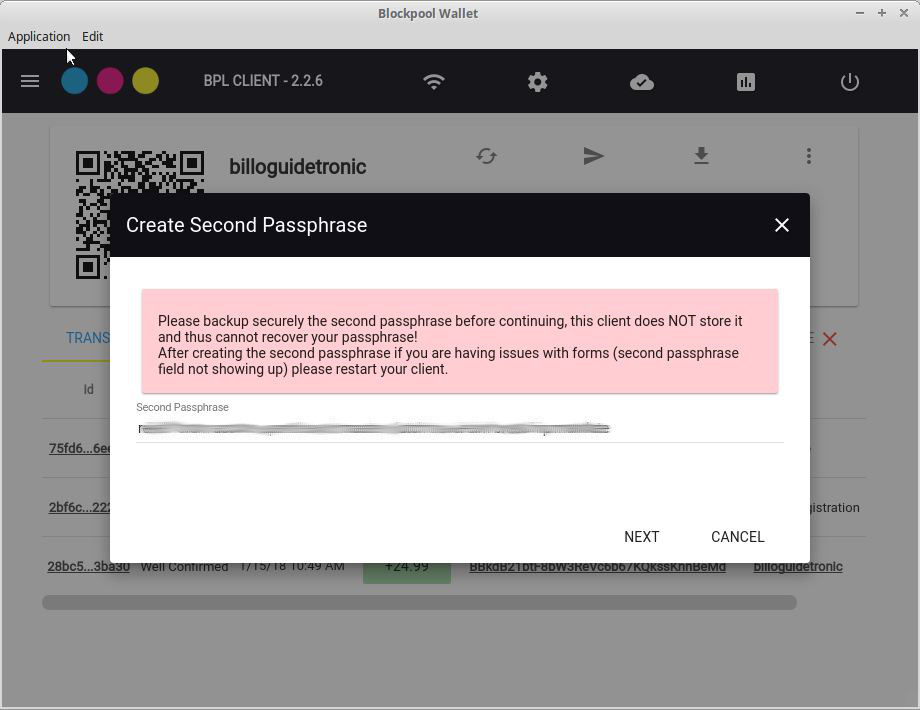
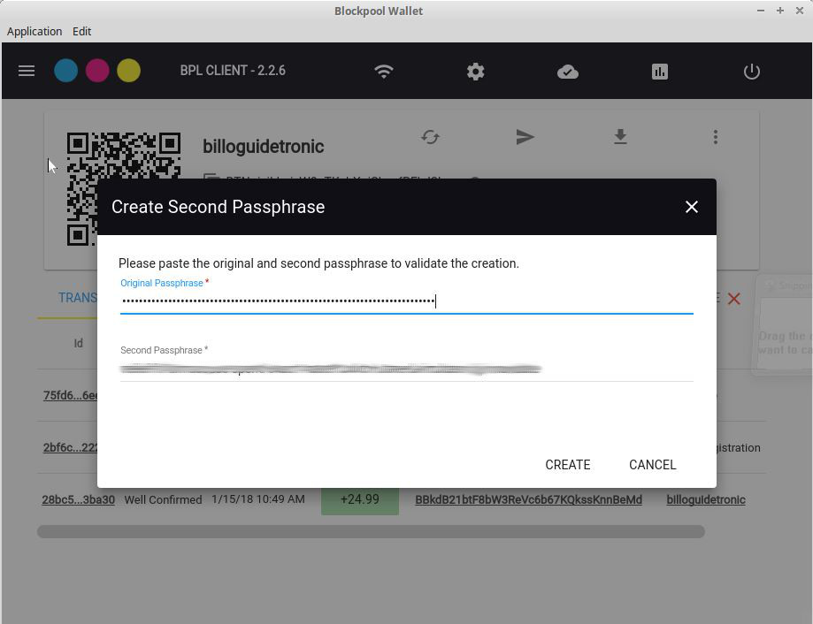
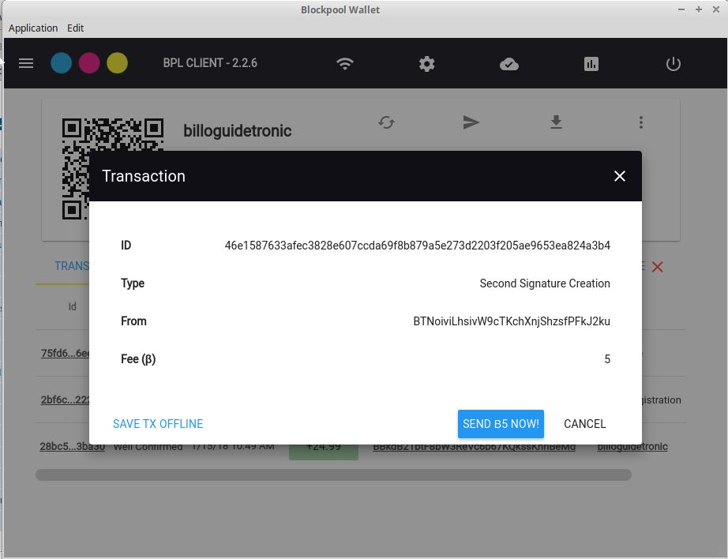
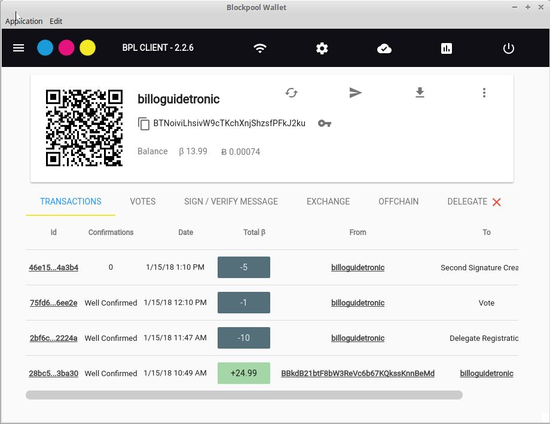

# Creating A Second Passphrase

1. Open Blockpool-Desktop and open the account to be used for the delegate.

 and select SECOND Passphrase

3. Backup your second passphrase somewhere safe! **_If you loose this, you loose your BPL_**

4. Confirm by entering your passphrase and your 2nd passphrase

5. Create the 2nd passphrase transaction (5 BPL)

6. Creation was successful

