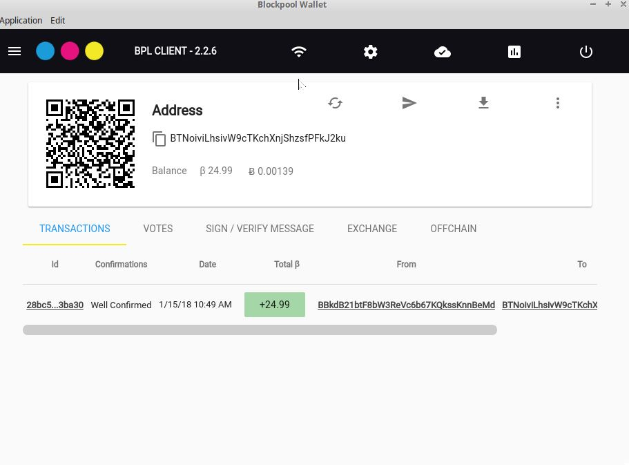
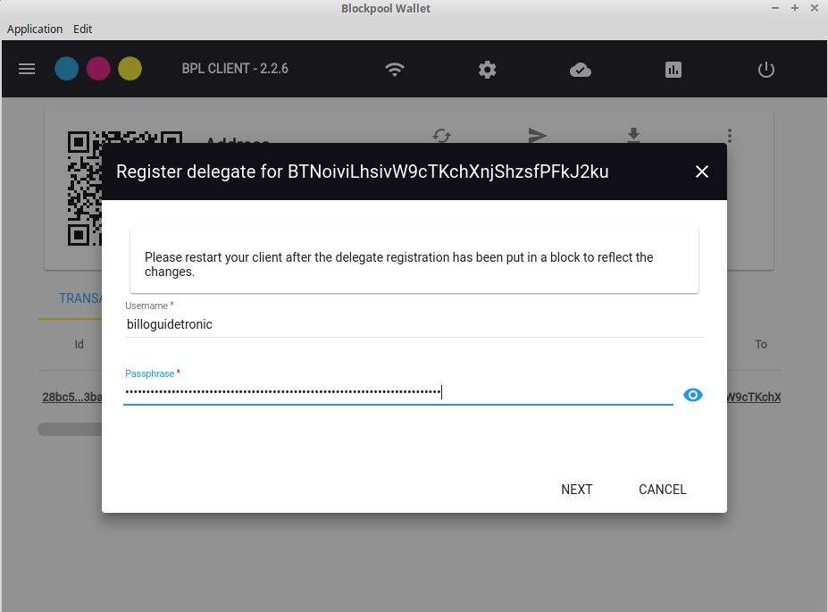
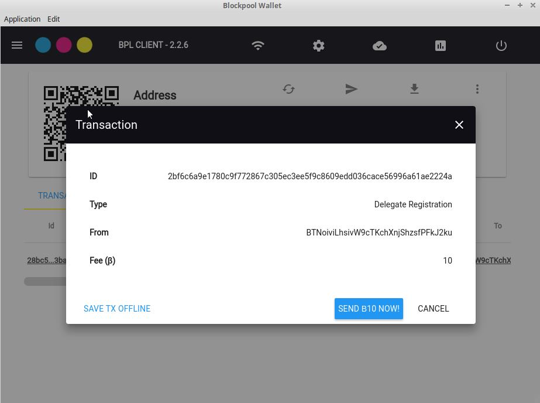
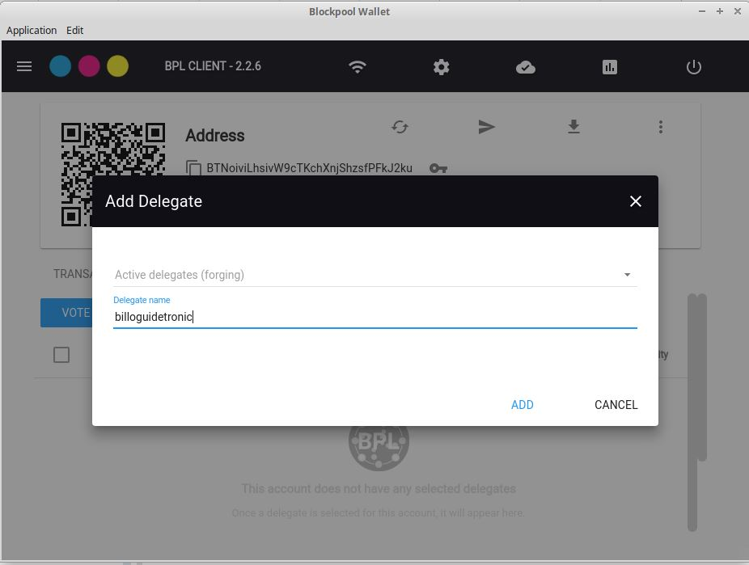
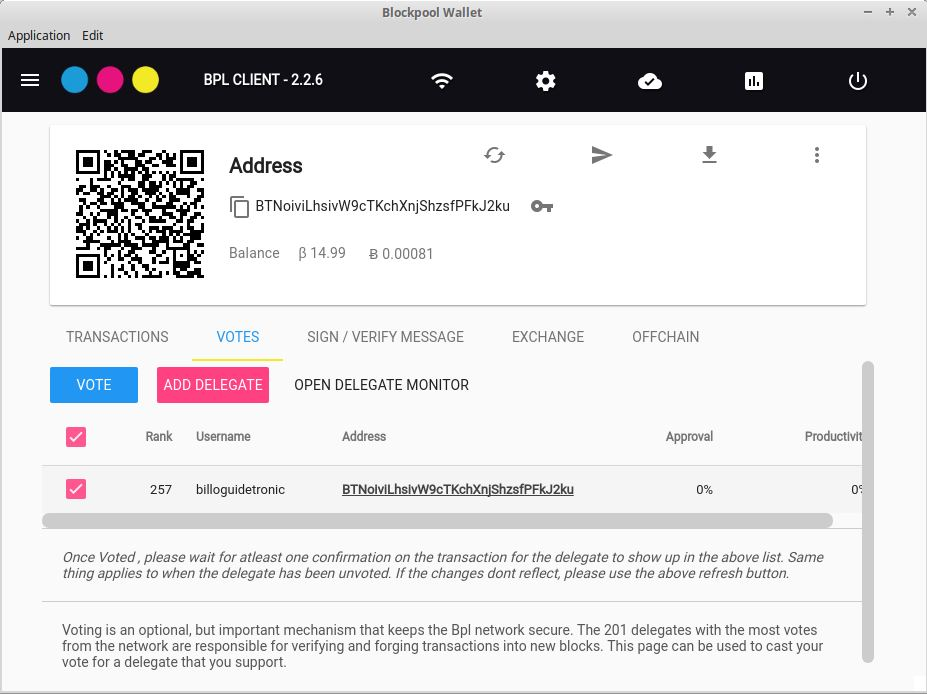
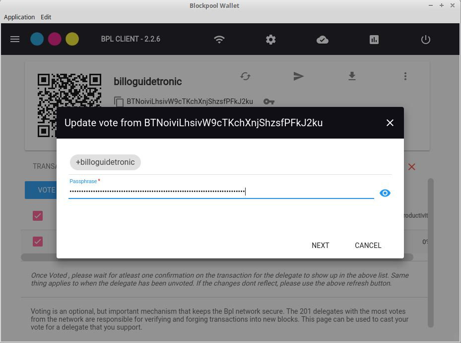
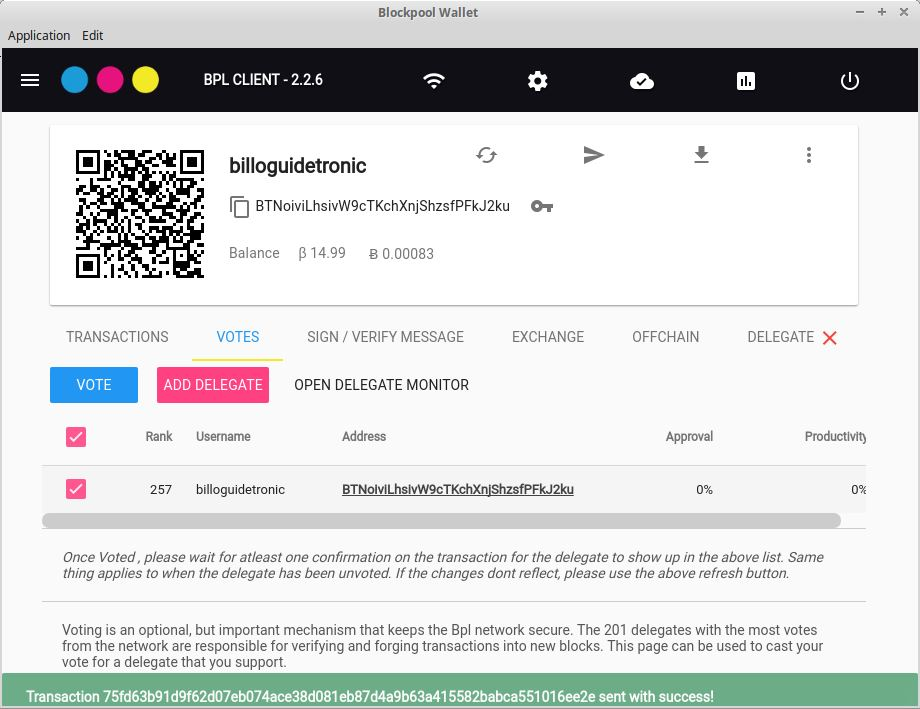

# Setting up a Blockpool Delegate

## Requirements
- A Blockpool wallet ([Guide](../Installation/BPL-Desktop.md)). For the sake of this guide we are going to use the Blockpool-Desktop client. Take note of your passphrase as this will be needed for the node configuration.
** _It is STRONGLY recommended to create a second passphrase ([Guide](./2ndpassphrase.md)) if you are running a node._ **

- 11 BPL to register and vote for your delgate + BPL to stake. 

- Reliable Hardware and internet conncetion. This is crucial to not only maximize returns on your BPL that is forging, but also to secure the Blockpool network.
There are two approaches to this. You can either host the node on your own PC or host on a Virtual Private Server (VPS) / dedicated server. Overall system minimal requirements
are 1 core and 4 GB RAM but see Node Considerations for further information on requirements

- Linux. This has been tested with Ubuntu v16.0.4 and these instructions will be for that flavor of linux

- BPL-node ([Guide](../Installation/BPL-Node.md)) installed and synced with the network 

## Getting started

1. Open Blockpool-Desktop and open the account to be used for the delegate.

2. Click the menu icon (Three verticle dots) and select REGISTER DELEGATE

3. Enter the name you want the delegate to be known as (in the example billoguidetronic) and enter your passphrase for your account

4. Confirm the registration. This creates a transaction on the blockchain to register your delegate (10 BPL)

5. Vote for your delegate. Open the vote tab in your account and click ADD DELEGATE

6. Since this is a new node, enter your delegate name in the second field provided (ours is billoguidetronic) and click add

7. Once your delegate is loaded in the vote screen, click on Vote

8. Confirm the delegate name and enter your passphrase

Then confirm and send your vote transaction (1 BPL)

Successful vote for your delegate

