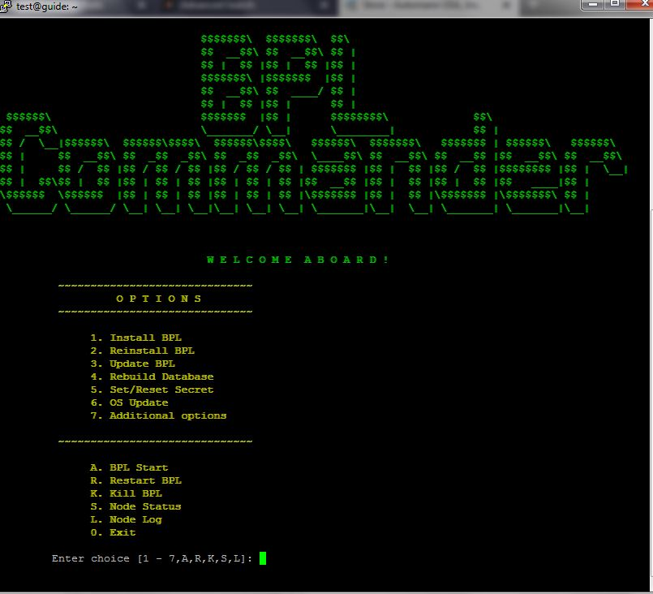

# Setting up a Blockpool Delegate

## Prerequisites
- A Blockpool wallet ([Guide](../Installation/BPL-Desktop.md)). This guide uses the [BPL Desktop Wallet](https://github.com/blockpool-io/BPL-desktop/releases).

- BPL-node ([Guide](../Installation/BPL-Node.md)) installed and synced with the network. This should go without saying, but your node should have adequate hardware and a reliable internet connection. (See [Node Considerations] for more detail.)
  - Dedicated internet connection with your own PC, Virtual Private Server (VPS), or dedicated server.
  - At least 4 GB RAM

- 16 BPL to register your delegate (10 BPL), add a second passphrase (5 BPL), and vote for your delegate (1 BPL).

## Create an account
If you haven't already, create an account in your BPL Wallet. Proper security practices are outside of the scope of this guide, but be sure to save your passphrase in a secure place. You will need it in general if you want to be able to spend your BPL, and you will also need it to add your delegate to your node. **_It is also STRONGLY recommended to create a second passphrase ([Guide](./2ndpassphrase.md)) if you are going to run a delegate. This will allow extra security because your main passphrase is stored on your delegate server._**

## Configure Your Node

**NOTE:** This step does not have to come first, but if it does not, you will have a non-100% productivity rating, and if you are anything like us **_YOU WILL NOT LIKE IT_**.

Assuming you already have a properly secured and synced node, the next thing you will need to do is add the configuration for your delegate. You will need to add the passphrase you created for your account in the previous step to the config.mainnet.json file in the forging.secret section as shown below:

```
Change the following in config.mainnet.json :

"forging": {
  ...
  
  secret: [
    <Add your passphrase here>
  ]
}
```

## Register your Delegate

First, open Blockpool-Desktop and open the account to be used for the delegate.


Then, click the menu icon (the three vertical dots) and select REGISTER DELEGATE.


In the dialog box, enter the name of your delegate (it must be unique, in our example, we are using billoguidetronic) and then enter your passphrase for your account.


Confirm the registration. This will create a transaction on the blockchain to register your delegate (10 BPL).


You will now need to wait for the transaction to propagate through the network. It can take as long as 15-30 seconds. You can potentially speed up the process by hitting the refresh button. Alternatively, you may need to restart the wallet. Once you see that the delegate registration has been accepted, you can move on to the next step.

## Vote for Your Delegate
Open the vote tab in your account and click ADD DELEGATE


Since this is a new node, enter your delegate name in the second field provided (ours is billoguidetronic) and click ADD.


Once your delegate is loaded in the vote screen, click on Vote.


Confirm the delegate name and enter your passphrase.


Then, confirm and send your vote transaction (1 BPL).


This is what it should look like aftera a successful vote for your delegate.


## Confirm your delegate is forging

In order for your delegate to forge, your node must be in sync with the network and can take multiple hours to fully sync.

### Via BPLcommander

1. From the BPLcommander menu, select ```S Node Status```.



2. Enter your delegate's Address and hit enter.


3. If your delegate is forging it will display ```Forging : true ``` in your stats right below your delegate name.


### Via block explorer

1. Open a browser and navigate to [bplexp.blockpool.io/delegateMonitor](http://bplexp.blockpool.io/delegateMonitor).

2. Locate your delegate by its name (CTRL+F to search).

3. If your delegate is forging it will have a solid green ball for its status.


### Via node log

1. Open your BPL-node log with nano. This is assuming you are in your home directory.

```nano ./BPL-node/logs/bpl.log```

2. Open the search with ```Ctrl+W``` and enter ```forging node``` and hit enter. Note, depending on the log size and hardware this can take a few moments to complete the search.

3. If your delegate is forging you will be rewarded with the following:


And this is what your log will say when you forge a block:


## Profit
Congratulations, you have successfully set up a BPL Delegate. Enjoy the reward you receive for securing the BPL network.

