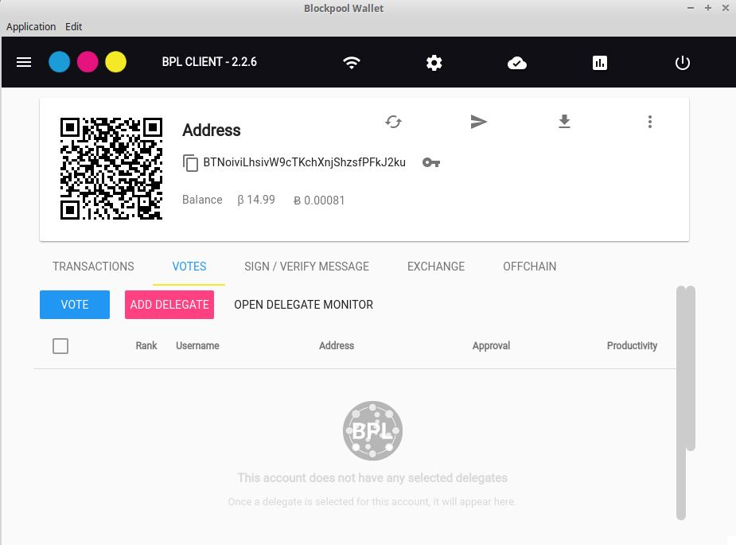
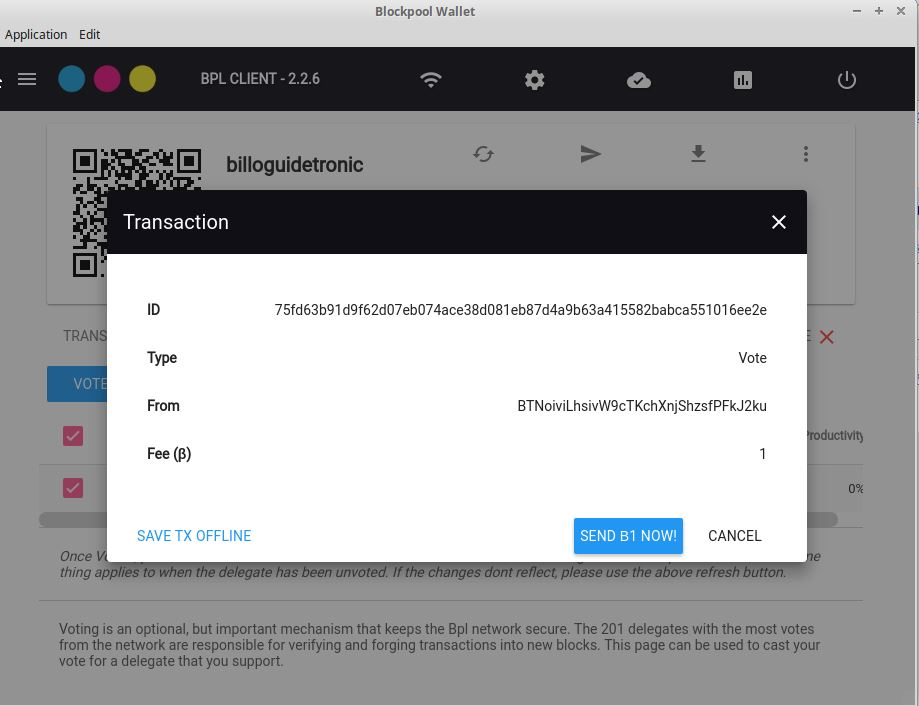

# Setting up a Blockpool Delegate

## Requirements
- A Blockpool wallet ([Guide](../Installation/BPL-Desktop.md)). For the sake of this guide we are going to use the Blockpool-Desktop client. Take note of your passphrase as this will be needed for the node configuration.
**_It is STRONGLY recommended to create a second passphrase ([Guide](./2ndpassphrase.md)) if you are running a node._**

- 11 BPL to register and vote for your delgate + BPL to stake. 

- Reliable Hardware and internet conncetion. This is crucial to not only maximize returns on your BPL that is forging, but also to secure the Blockpool network.
There are two approaches to this. You can either host the node on your own PC or host on a Virtual Private Server (VPS) / dedicated server. Overall system minimal requirements
are 1 core and 4 GB RAM but see Node Considerations for further information on requirements

- Linux. This has been tested with Ubuntu v16.0.4 and these instructions will be for that flavor of linux

- BPL-node ([Guide](../Installation/BPL-Node.md)) installed and synced with the network 


## Getting started

### 1. Open Blockpool-Desktop and open the account to be used for the delegate.


### 2. Click the menu icon (Three verticle dots) and select REGISTER DELEGATE


### 3. Enter the name you want the delegate to be known as (in the example billoguidetronic) and enter your passphrase for your account


### 4. Confirm the registration. This creates a transaction on the blockchain to register your delegate (10 BPL)


### 5. Vote for your delegate. Open the vote tab in your account and click ADD DELEGATE



### 6. Since this is a new node, enter your delegate name in the second field provided (ours is billoguidetronic) and click add


### 7. Once your delegate is loaded in the vote screen, click on Vote


### 8. Confirm the delegate name and enter your passphrase


Then confirm and send your vote transaction (1 BPL)



Successful vote for your delegate


### 9. Confirm your delegate is forging

In order for your delegate to forge, your node must be in sync with the network and can take multiple hours to fully sync.

#### Via BPLcommander

1. from the BPLcommander menu select ```S Node Status```


2. Enter your delegates Address and hit enter.


3. If your delegate is forging it will display ```Forging : true ``` in your stats right below your delegate name


#### Via block explorer

1. Open a browser and navigate to [bplexp.blockpool.io/delegateMonitor](http://bplexp.blockpool.io/delegateMonitor)

2. Locate your delegate by its name (CTRL+F to search)

3. If your delegate is forging it will have a solid green ball for its status


#### Via node log

1. Open your BPL-node log with nano. This is assuming you are in your home directory

```nano ./BPL-node/logs/bpl.log```

2. Open the search with ```Ctrl+W``` and enter ```forging node``` and hit enter. Note, depending on the log size and hardware this can take a few moments to complete the search.

3. If your delegate is forging you will be rewarded with the following:


And this is what your log will say when you forge a block


